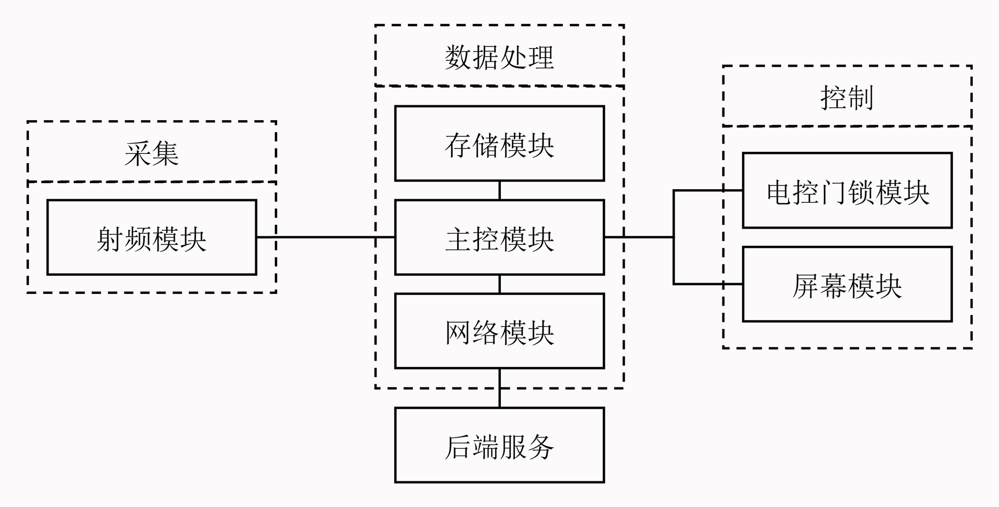
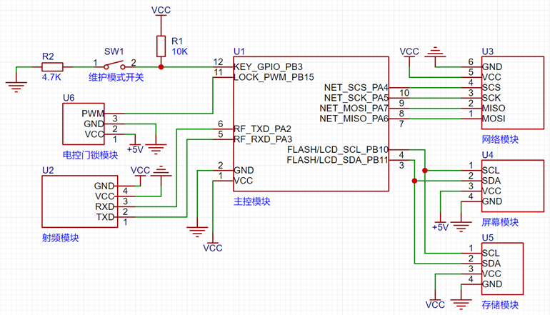

# Identity Authentication Access Control System Based on NFC Technology - Hardware

🌍 *[简体中文](README.md) ∙ [English](README-EN.md)*

An identity authentication access control system based on NFC technology. Leveraging the portability and intelligence of mobile terminal devices, the system achieves rapid and secure identity verification through NFC technology. This repository is part of the implementation of the hardware.

## Main Technologies

- Arduino
- STM32
- PN532
- W5500
- LCD1602 (PCF8574)
- AT24C02
- Servo Motor

## Running the Project

> Note: This repository is for the hardware part of the project, which needs to be used in conjunction with the server.

This project uses `PlatformIO` as the development environment and has custom board configurations [Arduino_Core_STM32](https://github.com/YukiIsait/Arduino_Core_STM32) and [PlatformIO_STM32](https://github.com/YukiIsait/PlatformIO_STM32), therefore, the PlatformIO plugin must be installed and the corresponding configuration files imported before compilation can proceed.

## Project Preview

1. Structure Diagram

    

2. Schematic Diagram
    
    

## License

This project is licensed under the MIT License. See the [LICENSE](LICENSE.md) file for details.
