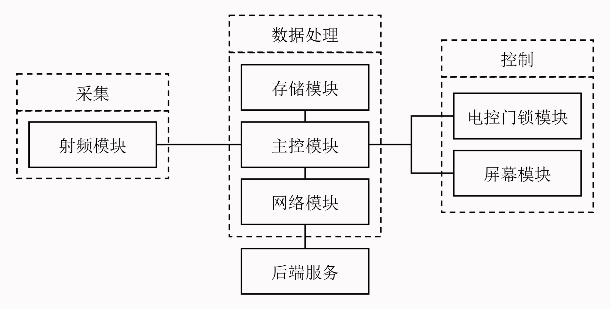

# 基于NFC技术的身份验证门禁系统 - 硬件

🌍 *[English](README-EN.md) ∙ [简体中文](README.md)*

一种基于NFC技术的身份验证门禁系统，利用移动终端设备的便携性和智能化特点，通过NFC技术实现快速、安全的身份验证，并通过物联网技术管理身份信息，提高安全性和灵活性。本仓库为硬件的实现部分。

## 主要技术

- Arduino
- STM32
- PN532
- W5500
- LCD1602 (PCF8574)
- AT24C02
- 舵机

## 运行项目

> 注意：本仓库为项目的硬件部分，需要配合服务端使用。

本项目使用了`PlatformIO`作为开发环境，并使用了自定义的开发板配置[Arduino_Core_STM32](https://github.com/YukiIsait/Arduino_Core_STM32)和[PlatformIO_STM32](https://github.com/YukiIsait/PlatformIO_STM32)，因此需要安装`PlatformIO`插件并导入相应的配置文件后才能编译。

## 项目预览

1. 结构图

    

2. 原理图

    

## 开源许可

本项目开源于MIT许可证，详见[LICENSE](LICENSE.md)文件。
